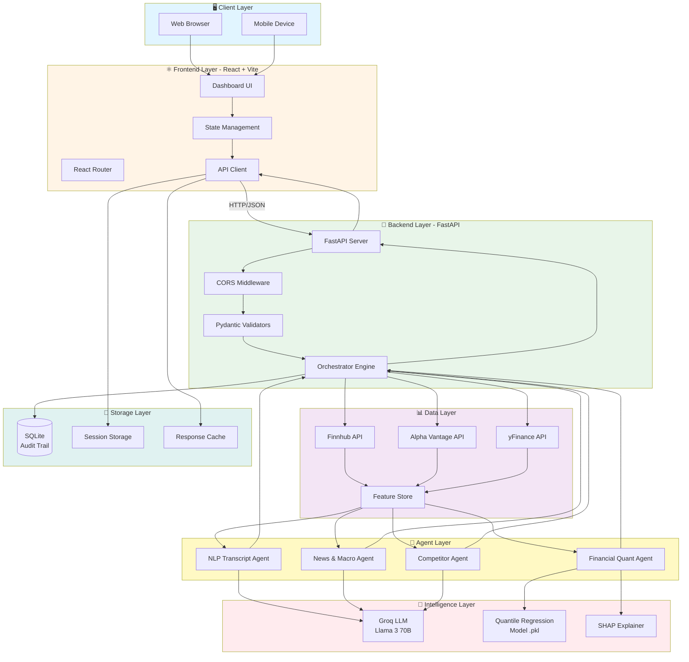
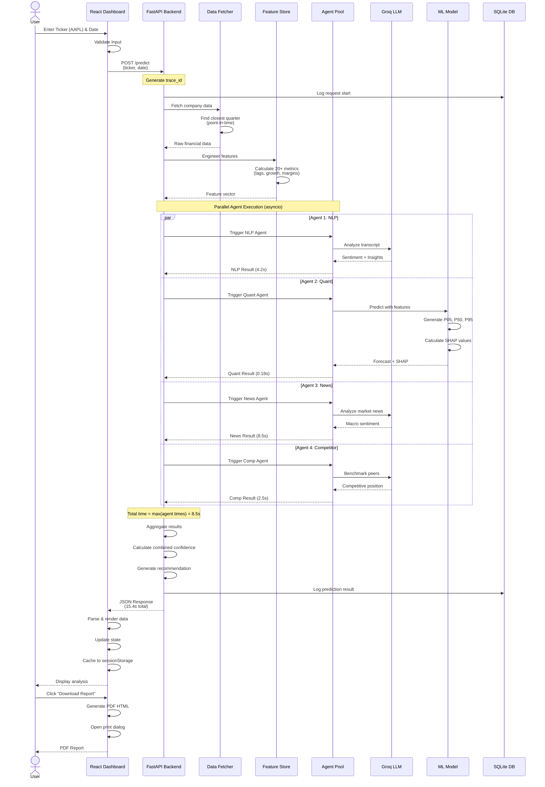
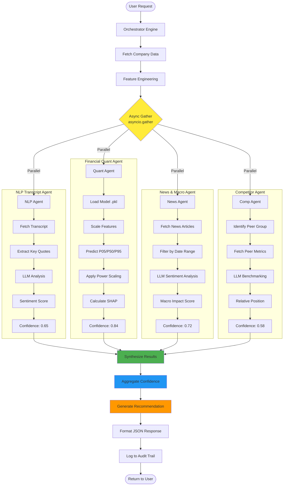
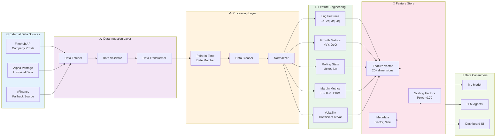
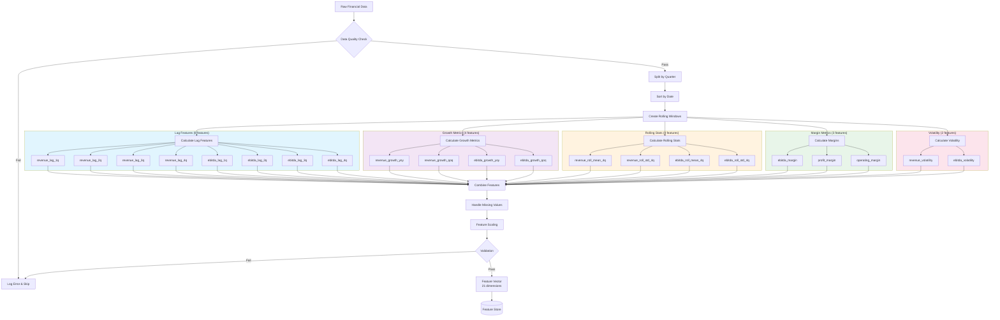

# FinSight AI - System Architecture

## Complete Visual Architecture Documentation

This document contains comprehensive Mermaid diagrams representing the entire FinSight AI system architecture.

---

## 📊 Table of Contents

1. [High-Level System Architecture](#1-high-level-system-architecture)
2. [Request Flow Sequence](#2-request-flow-sequence)
3. [Agent Orchestration Flow](#3-agent-orchestration-flow)
4. [Data Pipeline Architecture](#4-data-pipeline-architecture)
5. [Feature Engineering Pipeline](#5-feature-engineering-pipeline)
6. [ML Model Architecture](#6-ml-model-architecture)
7. [Frontend Component Hierarchy](#7-frontend-component-hierarchy)
8. [API Layer Architecture](#8-api-layer-architecture)
9. [Database Schema](#9-database-schema)
10. [Deployment Architecture](#10-deployment-architecture)
11. [Error Handling Flow](#11-error-handling-flow)
12. [Latency Optimization Flow](#12-latency-optimization-flow)

---

## 1. High-Level System Architecture



---


## 2. Request Flow Sequence



---


## 3. Agent Orchestration Flow



---


## 4. Data Pipeline Architecture



---


## 5. Feature Engineering Pipeline



---


## 6. ML Model Architecture

```mermaid
graph TB
    Input[Feature Vector<br/>21 dimensions] --> Preprocess[Preprocessing]
    
    Preprocess --> Model_Ensemble{Quantile Regression<br/>Ensemble}
    
    Model_Ensemble --> Model_P05[Model P05<br/>GradientBoosting<br/>alpha=0.05]
    Model_Ensemble --> Model_P50[Model P50<br/>GradientBoosting<br/>alpha=0.50]
    Model_Ensemble --> Model_P95[Model P95<br/>GradientBoosting<br/>alpha=0.95]
    
    Model_P05 --> Raw_P05[Raw P05 Prediction]
    Model_P50 --> Raw_P50[Raw P50 Prediction]
    Model_P95 --> Raw_P95[Raw P95 Prediction]
    
    Raw_P05 --> Check{Check Ordering}
    Raw_P50 --> Check
    Raw_P95 --> Check
    
    Check -->|Correct| Scale[Apply Power Scaling]
    Check -->|Incorrect| Fix[Fix with np.percentile]
    
    Fix --> Scale
    
    subgraph Scaling["Power Scaling (0.70 exponent)"]
        Scale --> Calc_Scale[Calculate Scale Factor<br/>scale = (input_size / training_avg)^0.70]
        Calc_Scale --> Apply_Rev[Apply to Revenue<br/>scaled_rev = raw_rev * scale]
        Calc_Scale --> Apply_EBIT[Apply to EBITDA<br/>scaled_ebitda = raw_ebitda * scale]
    end
    
    Apply_Rev --> Final_Rev[Final Revenue Forecast<br/>P05, P50, P95]
    Apply_EBIT --> Final_EBIT[Final EBITDA Forecast<br/>P05, P50, P95]
    
    Final_Rev --> SHAP_Calc[SHAP Calculation]
    Final_EBIT --> SHAP_Calc
    
    subgraph SHAP_Analysis["SHAP Explainability"]
        SHAP_Calc --> Tree_Explainer[TreeExplainer]
        Tree_Explainer --> SHAP_Values[SHAP Values<br/>per feature]
        SHAP_Values --> Top_Features[Top 5 Features<br/>by |SHAP|]
    end
    
    Top_Features --> Confidence[Calculate Model<br/>Confidence Score]
    
    Confidence --> Output{Output}
    
    Output --> Forecast[Forecast Object]
    Output --> Explain[Explainability Object]
    Output --> Conf[Confidence Score]
    
    style Model_Ensemble fill:#ffeb3b
    style Scaling fill:#4caf50
    style SHAP_Analysis fill:#2196f3
    style Output fill:#ff9800
```

---

