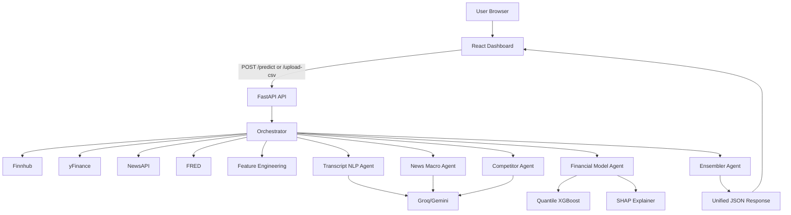
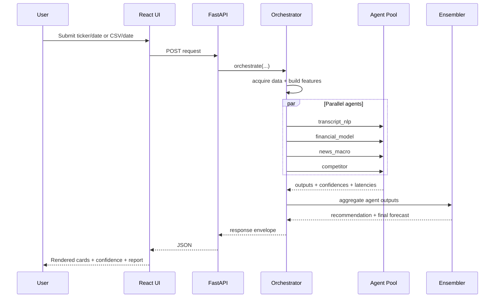

# FinSight AI - Detailed Project Report

## 1) Project Identity

**Project Name:** FinSight AI  
**Type:** Agentic Multi-Model Financial Intelligence Platform  
**Primary Goal:** Generate explainable financial forecasts and investment-oriented recommendations from mixed data inputs (market data, transcript-style context, macro/news signals, and peer benchmarks).

This report documents the repository implementation in depth: architecture, backend logic, frontend UX flow, input/output contracts, model pipeline, deployment shape, testing maturity, and operational risks.

---

## 2) Repository Topology

At a high level, the repo is split into:

- `backend/`: FastAPI API, orchestrator, agents, data adapters, model training, explainability.
- `frontend/`: React + Vite single-page dashboard.
- `docs/`: architecture and project docs.
- root runtime/deploy files (`docker-compose.yml`, `render.yaml`, setup scripts).

### 2.1 Backend Key Areas

- `orchestrator/`
  - `api.py`: API routes and request models.
  - `orchestrate.py`: main orchestration pipeline.
- `agents/`
  - `financial_model.py`: quantile forecast engine (XGBoost-based model bundle).
  - `transcript_nlp.py`, `news_macro.py`, `competitor.py`: specialist LLM agents.
  - `ensembler.py`: final recommendation synthesis.
  - `llm_client.py`: provider routing and fallback.
- `data_sources/`
  - `finnhub_loader.py`, `news_loader.py`, `fred_loader.py`, `csv_loader.py`.
- `features/`
  - `feature_store.py`: training feature engineering.
  - `org_feature_store.py`: org/private upload feature engineering.
- `explainability/`
  - `explainer.py`: SHAP computations.
- `database/`
  - `mongodb.py`: optional org persistence.
- `audit/`
  - `audit_trail.py`: audit persistence abstraction (currently disabled path in local flow).

### 2.2 Frontend Key Areas

- `src/App.jsx`: shell layout (sidebar/topbar + dashboard mount).
- `src/pages/SimpleDashboard.jsx`: primary user workflow.
- `src/index.css`: theme + utility layer.

---

## 3) Functional Purpose and Product Modes

The product supports two primary usage modes from the UI:

1. **Investor mode (public ticker)**
   - User enters `ticker` + `analysis date`.
   - Frontend calls `POST /predict`.
   - Backend tries live market data first, then controlled fallback logic.

2. **Organization mode (uploaded CSV)**
   - User uploads CSV + date.
   - Frontend calls `POST /upload-csv`.
   - Backend parses file into model-compatible engineered features.
   - Same multi-agent pipeline is run on uploaded feature set.

Additionally, org/private Mongo-based flows exist in route modules (`routes/upload.py`, `routes/org_predict.py`), but those routers are currently not mounted in `orchestrator/api.py`.

---

## 4) Request Lifecycle (Detailed)

## 4.1 API Entry Points

In `backend/orchestrator/api.py`:

- `GET /health` and `GET /api/health`
- `POST /predict` and `POST /api/predict`
- `POST /upload-csv` and `POST /api/upload-csv`

`PredictRequest` currently accepts:

- `company_id: str`
- `as_of_date: str` (default `2024-12-31`)

CSV route accepts multipart:

- `file`
- `as_of_date` form field (default `2026-01-01`)

## 4.2 Orchestration Core

`backend/orchestrator/orchestrate.py` performs:

1. Request metadata generation (`request_id`, `trace_id`).
2. Mode detection:
   - `csv_mode`: when `override_source="csv_upload"`.
   - `org_mode`: when `org_features` provided.
3. Data acquisition path:
   - CSV path: trust provided engineered features.
   - Org path: trust provided engineered features + org context.
   - Public path:
     - Try Finnhub for financials/profile/peers.
     - If Finnhub fails, try yfinance + feature engineering.
4. If live data unavailable:
   - Controlled by `ALLOW_SYNTHETIC_FALLBACK` env flag.
   - If fallback disabled, request fails explicitly.
   - If enabled, uses `out/features_v1.pkl` feature store fallback.
5. Build agent-specific inputs (transcript, quant features, headlines+macro, peers).
6. Run agents in parallel with individual timing wrappers.
7. Capture degraded agents and partial status.
8. Call ensembler for recommendation + final forecast narrative.
9. Recompute aggregated confidence (geometric mean with degradation penalty).
10. Generate SHAP explanation.
11. Return response envelope with telemetry and explainability.

---

## 5) Agent System Deep-Dive

## 5.1 Base Agent Contract

`backend/agents/base.py` defines:

- common input fields (`request_id`, `trace_id`, `model_version`)
- common output confidence field (`0..1`)
- shared LLM invocation helper via `llm_client`

This gives a uniform orchestration surface for all agents.

## 5.2 LLM Provider Routing

`backend/agents/llm_client.py`:

- Discovers multiple Groq keys (`GROQ_API_KEY*`) and rotates on 429s.
- Falls back to Gemini if Groq unavailable.
- Enforces JSON-oriented response behavior.
- Includes `clean_json_response()` to strip markdown wrappers and extract JSON fragments.

Operational effect: resilient inference path under rate limits/provider issues.

## 5.3 Financial Model Agent

`backend/agents/financial_model.py`:

- Loads model bundle from `backend/out/financial_model.pkl`.
- Expects engineered feature vector aligned to saved `feature_cols`.
- Produces quantile forecasts for **revenue** and **EBITDA** (`p05`, `p50`, `p95`).
- Applies scale factor for out-of-distribution large companies (power-law style adjustment).
- Enforces quantile monotonicity using percentile ordering over raw quantile outputs.
- Computes confidence from interval width relative to median.
- Returns top gain-based feature importances from model booster.

## 5.4 Transcript NLP Agent

`backend/agents/transcript_nlp.py`:

- Parses transcript-style text and extracts:
  - driver sentences,
  - numeric facts,
  - sentiment,
  - top topics,
  - confidence.
- Chunks long transcript content for timeout risk control.
- Uses timeout and degraded fallback output if LLM fails.

## 5.5 News & Macro Agent

`backend/agents/news_macro.py`:

- Pulls macro indicators from FRED loader.
- Uses headlines + macro context prompt to generate impact score and events.
- Parses event impacts into normalized numeric form.
- Returns degraded neutral output on error.

## 5.6 Competitor Agent

`backend/agents/competitor.py`:

- Ingests peer financials + market-share-like signals.
- Returns relative position score and peer benchmark deltas.
- Supports alias parsing for common key naming variance.

## 5.7 Ensembler Agent

`backend/agents/ensembler.py`:

- Synthesizes all agent outputs into:
  - recommendation action (`buy|hold|sell|monitor`),
  - rationale,
  - simple language summary/verdict,
  - forecast package,
  - explanations,
  - human review flag.
- Has robust fallback when LLM unavailable, using quant model baselines.

---

## 6) Data Connectors and Input Processing

## 6.1 Finnhub Loader

`backend/data_sources/finnhub_loader.py`:

- Fetches quarterly reported financials.
- Tries multiple accounting concept IDs to map revenue/net income fields.
- Converts raw units to millions for consistency.
- Fetches profile stats and peer lists.

## 6.2 yFinance Loader

`backend/data/yfinance_loader.py`:

- Pulls quarterly financials, maps schema, enriches basic company context.
- Converts major financial metrics to millions.
- Produces fields aligned with internal training schema.

## 6.3 News Loader

`backend/data_sources/news_loader.py`:

- Uses NewsAPI for company and market headlines.
- Handles graceful fallback strings when unavailable.

## 6.4 Macro Loader

`backend/data_sources/fred_loader.py`:

- Pulls latest indicators (GDP growth, CPI, rates, unemployment, etc.).
- Computes trend deltas and summary text for LLM context.

## 6.5 CSV Loader

`backend/data_sources/csv_loader.py`:

- Validates required columns (`date`, `revenue`).
- Parses and normalizes numeric columns.
- Derives lag/rolling/growth/margin features.
- Emits standardized feature dict for quant model.

---

## 7) Feature Engineering and Model Training

## 7.1 Feature Store

`backend/features/feature_store.py` computes:

- revenue lags (1Q,2Q,4Q),
- EBITDA margin lag,
- 4Q rolling means/std,
- YoY and QoQ growth,
- one-hot scenarios (`bear|bull|neutral`),
- temporal split (70/15/15).

Artifacts:

- `backend/out/features_v1.pkl`
- `backend/out/feature_manifest.json`

## 7.2 Training Pipeline

`backend/train_pipeline.py`:

1. runs feature generation,
2. trains quantile models via FinancialModelAgent,
3. saves model artifacts to `backend/out/`.

## 7.3 Synthetic Data Generator

`backend/synthetic_financial_gen/generator.py`:

- Creates multimodal synthetic financial panel with scenario control.
- Produces transcripts, growth/margin paths, mismatch and restatement patterns.
- Supports reproducibility via fixed seed.

## 7.4 Evaluation

`backend/evaluation/evaluator.py`:

- Computes MAPE and interval coverage.
- Writes evaluation summary JSON.
- Config acceptance targets documented in `backend/config.yaml`.

---

## 8) Explainability and Transparency

`backend/explainability/explainer.py` uses SHAP TreeExplainer:

- returns ranked SHAP values (top contributors),
- includes metadata fields (`request_id`, versions, audit link placeholder),
- degrades gracefully if SHAP path fails.

Frontend surfaces SHAP as top drivers with directional color coding.

---

## 9) Frontend UX and Logic (Deep)

## 9.1 UI Structure

`frontend/src/App.jsx`:

- Persistent shell with sidebar and top bar.
- Mounts one main dashboard page.

`frontend/src/pages/SimpleDashboard.jsx` implements entire interaction layer:

- role switch (`investor` / `organization`),
- form controls for ticker/date or CSV/date,
- loading and error state,
- sessionStorage persistence,
- toast-like notifications,
- rich result rendering,
- telemetry panel,
- SHAP panel,
- confidence breakdown,
- JSON audit modal,
- printable executive report generation.

## 9.2 Notification and Error Handling

- `extractApiError()` attempts to parse backend JSON detail/message.
- Notifications auto-expire.
- Partial status responses trigger warning-level message.

This matches your desired UX preference to avoid silent failures and provide explicit user-facing feedback.

## 9.3 Report Generation

The dashboard constructs a styled HTML report in-browser and triggers print-to-PDF:

- executive summary,
- forecast intervals,
- confidence breakdown,
- SHAP top factors,
- trace id, timestamp, data source, and latency.

---

## 10) Input/Output Contracts (Concrete)

## 10.1 Predict Input

```json
{
  "company_id": "AAPL",
  "as_of_date": "2024-12-31"
}
```

## 10.2 CSV Upload Input

Multipart form:

- `file`: CSV file
- `as_of_date`: date string

## 10.3 Representative Response Envelope

```json
{
  "request_id": "req-xxxx",
  "trace_id": "trace-xxxx",
  "model_version": "bundle_v1",
  "status": "success|partial",
  "latency_ms": 12345,
  "result": {
    "final_forecast": {
      "revenue_p50": 0,
      "ebitda_p50": 0,
      "revenue_ci": [0, 0],
      "ebitda_ci": [0, 0]
    },
    "recommendation": {
      "action": "buy|hold|sell|monitor",
      "rationale": "...",
      "simple_summary": "...",
      "simple_verdict": "...",
      "key_risks": [],
      "key_strengths": []
    },
    "combined_confidence": 0.0,
    "explanations": [],
    "human_review_required": false
  },
  "data_source": "live_finnhub|csv_upload|org_upload",
  "explainability": {
    "confidence_breakdown": {
      "transcript_nlp": 0.0,
      "financial_model": 0.0,
      "news_macro": 0.0,
      "competitor": 0.0
    },
    "degraded": [],
    "shap_values": []
  },
  "company_profile": {},
  "agents_called": [],
  "agent_latencies": {},
  "degraded_agents": []
}
```

---

## 11) Architecture Diagrams

## 11.1 Component Diagram



## 11.2 Sequence Diagram



---

## 12) Deployment and Runtime

## 12.1 Docker Compose (Root)

- backend service on `8000`
- frontend service on `5173`
- backend healthcheck endpoint `/health`
- frontend depends on backend health

## 12.2 Backend Container

- Python 3.11 slim
- installs requirements
- copies backend modules and `out/` assets
- runs uvicorn with reload

## 12.3 Frontend Container

- Node 20 alpine
- installs npm deps
- runs Vite dev server with host binding

## 12.4 Cloud Deploy Spec

`render.yaml` builds backend, trains model, and starts API.

---

## 13) Testing and Quality Status

## 13.1 Present Test Surfaces

- core backend tests in `backend/tests/`
- synthetic generator tests in `backend/synthetic_financial_gen/tests/test_generator.py`
- multiple manual diagnostic scripts in `backend/tests/manual/`

## 13.2 Maturity Findings

- Some tests/scripts are stale against current orchestrator signature and runtime behavior.
- Several manual tests are exploratory and not CI-grade assertions.
- A retraining utility references a `FeatureStore` class that is not present in current feature_store implementation.

Practical implication: strong conceptual coverage but mixed maintainability in automated verification.

---

## 14) Security and Reliability Notes

1. **External dependency concentration**
   - Full-quality output depends on Groq/Gemini + Finnhub + NewsAPI + FRED keys.

2. **Fallback transparency**
   - Good: can disable synthetic fallback explicitly (`ALLOW_SYNTHETIC_FALLBACK=false`).

3. **Audit persistence**
   - Current audit module path is largely no-op in local/dev state.

4. **Org/private flows**
   - Implementation exists but route mounting is commented in main API.

5. **Frontend endpoint handling**
   - Current dashboard uses hardcoded localhost endpoint calls instead of centralized env-based API abstraction.

---

## 15) Strengths

1. Real orchestration design with parallelized specialists.
2. Clear confidence + degraded-agent reporting model.
3. Quantile forecasts with explainability.
4. User-friendly dashboard with visible errors and partial-result signaling.
5. Executive report export integrated in UI.
6. Data path flexibility (public ticker, CSV, org/private design).

---

## 16) Gaps and Technical Debt

1. Test drift and script inconsistency.
2. Partially disabled production modules (audit/org mounting).
3. High reliance on third-party API uptime/keys.
4. Mixed old/new code paths and TODO gates in core API module.
5. Some configuration/documentation mismatch across utilities.

---

## 17) Prioritized Improvement Roadmap

1. **Stabilize and align tests**
   - normalize orchestrator invocation signatures in tests,
   - convert key manual scripts into deterministic integration tests.

2. **Re-enable production routes intentionally**
   - mount org and upload routers once Mongo deployment expectations are finalized.

3. **Harden audit trail**
   - complete Mongo audit persistence and retrieval path.

4. **Standardize API base URL usage in frontend**
   - use env-driven base URL or Vite proxy-only strategy.

5. **Unify training/retraining utilities**
   - remove outdated class references and keep one canonical retrain flow.

6. **Add release-grade observability**
   - structured logs, error categorization, and rate-limit dashboards.

---

## 18) Final Assessment

FinSight AI is a substantial multi-agent financial analysis system with meaningful implementation depth and clear product intent. The core architecture and request execution path are strong. The primary limitation is engineering hardening rather than concept quality: test alignment, production route toggles, and consistency of utility scripts.

With targeted cleanup on those areas, the platform can move from advanced prototype to reliable production-grade analytics service.
